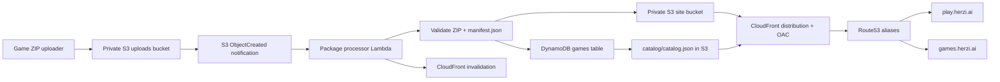

# Architecture

## Production Shape

## Design Decisions

**Private S3 origins**

The site bucket is not public. CloudFront uses Origin Access Control and signed origin requests, which gives public users a CDN URL while preventing direct S3 object access. This is safer than enabling S3 website hosting publicly.

**CloudFront Function for directory indexes**

S3 REST origins do not automatically serve `index.html` for `/games/foo/`. A viewer-request CloudFront Function rewrites clean directory URLs to `index.html` before S3 sees them.

**S3 notifications for MVP eventing**

S3 ObjectCreated notifications are direct, cheap, and low-latency. EventBridge can be added later when the workflow needs fan-out, audit routing, retries, or multiple subscribers.

**DynamoDB as source of truth, JSON as read model**

DynamoDB stores the authoritative game metadata. The static frontend reads `catalog/catalog.json`, a denormalized read model generated by Lambda, so the public website remains static and CloudFront-cacheable.

**On-demand DynamoDB billing**

`PAY_PER_REQUEST` avoids capacity planning and is friendly to low or spiky traffic.

**ACM in us-east-1**

CloudFront requires ACM certificates in `us-east-1`. The Terraform root uses a provider alias for that certificate module.

**Remote state bootstrap**

The `bootstrap` environment creates the S3 state bucket and DynamoDB lock table. The `prod` environment uses that backend. Terraform's S3 backend now supports native lockfiles; this repo enables that and also includes a DynamoDB lock table for teams that require S3 + DynamoDB state locking.

## MVP Runtime Flow

1. A ZIP is uploaded to `s3://<upload-bucket>/incoming/<game>.zip`.
2. S3 invokes Lambda for `.zip` files under `incoming/`.
3. Lambda rejects unsafe ZIP paths, missing manifests, missing entrypoints, oversize archives, and unsupported package shapes.
4. Lambda reads `manifest.json` and builds a normalized game record.
5. Lambda replaces the deployed prefix `games/{game_id}/`.
6. Lambda writes the game record to DynamoDB.
7. Lambda scans the catalog table and writes `catalog/catalog.json`.
8. Lambda invalidates `/games/{game_id}/*`, `/games/{game_id}/`, and `/catalog/catalog.json`.
9. The static frontend fetches the catalog and links to each game.

